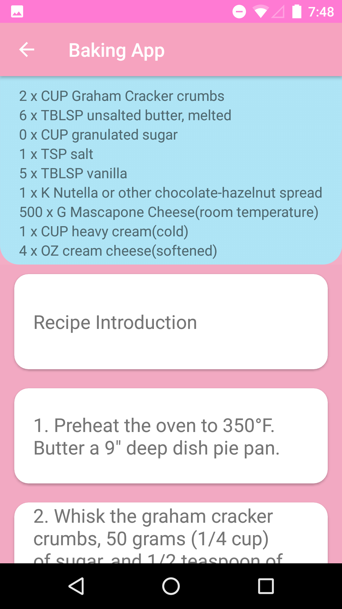

# BakingApp

Android App to list recipes and display step-by-step with a guiding video. This is part of the Udacity curriculum for the Android Nanodegree.

Contains:
* Manage Device Orientation.
* ExoPlayer.
* Homescreen Widget.
* Material Design.

  
  

  
  

